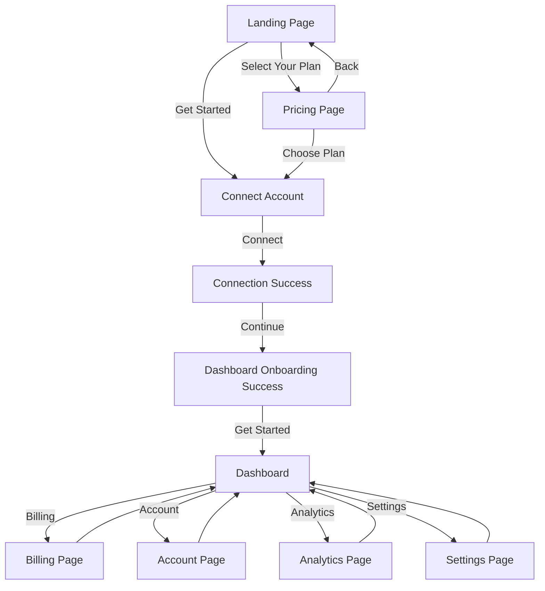

# User Flow Diagram

## Flow Description

1. **Landing Page**
   - Entry point for new users
   - Contains the "Get Started" CTA button

2. **Connect Account** `(onboarding/connect-account)`
   - Form to connect social media accounts
   - Includes platform selection and authentication

3. **Connection Success** `(onboarding/connect-account/success)`
   - Confirmation of successful account connection
   - Shows next steps

4. **Dashboard Onboarding Success** `(dashboard/onboarding-success)`
   - Welcome message
   - Overview of features
   - Call to action to get started

5. **Main Dashboard** `(dashboard)`
   - Central hub with navigation to all features
   - Quick overview of account status

### Navigation Options from Dashboard

- **Billing**: Manage subscription and payment methods
- **Account**: Update profile and security settings
- **Analytics**: View performance metrics
- **Settings**: Configure application preferences

## Technical Notes

- Built with Next.js App Router
- Uses file-based routing
- Responsive design for all screen sizes
- Protected routes for authenticated users only
