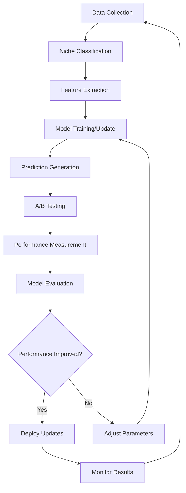

# AI Improvement Workflow - Master Implementation Plan

## 🚀 Executive Summary

This document outlines the comprehensive implementation of an AI-powered optimization system that continuously improves all workflows through machine learning, multi-agent deployment, and niche-specific optimization. The system creates a self-improving feedback loop that optimizes performance over time.

## 📋 Current State Analysis - TODOs and Gaps

### Critical Implementation Gaps Identified:

#### Data Collection Workflow
- **TODO**: Complete TikTok API integration (`TikTokClient.ts` lines 95, 108)
- **TODO**: Complete Instagram API integration (`InstagramClient.ts` lines 202, 206)
- **TODO**: Implement YouTube video upload functionality (`YouTubeClient.ts` line 208)
- **Gap**: Real-time data streaming pipeline
- **Gap**: Data quality validation system
- **Gap**: Niche-specific data collection strategies

#### Service Layer Implementations
- **TODO**: Complete autoposting service (`autoposting.ts` - currently placeholder)
- **TODO**: Complete content generation service (`contentGeneration.ts` - currently placeholder)
- **TODO**: Complete competitor tactics service (`competitorTactics.ts` - currently placeholder)
- **TODO**: Complete video optimization service (`videoOptimization.ts` - currently placeholder)

#### AI Improvement Workflow
- **Gap**: Machine learning model training pipeline
- **Gap**: Niche-specific model variants
- **Gap**: Real-time model inference
- **Gap**: A/B testing automation
- **Gap**: Computer vision implementation (currently stub in `vision.ts`)

#### Auth and Security
- **TODO**: Complete auth code exchange for all platforms (`auth-token-manager.service.ts` line 358)
- **Gap**: Token refresh automation
- **Gap**: Rate limiting optimization

## 🧠 Machine Learning Architecture

### Core ML Models by Function

#### 1. Engagement Prediction Engine
```typescript
interface EngagementPredictionModel {
  modelType: 'XGBoost' | 'LightGBM';
  inputFeatures: [
    'caption_length', 'hashtag_count', 'posting_time', 'day_of_week',
    'sentiment_score', 'topic_relevance', 'visual_quality_score',
    'user_follower_count', 'historical_engagement', 'platform_algorithm_score'
  ];
  outputTarget: 'engagement_rate_prediction';
  nicheVariants: NicheModel[];
}
```

#### 2. Content Optimization Engine
```typescript
interface ContentOptimizationModel {
  modelType: 'GPT-4o-mini';
  specialization: 'content_enhancement';
  capabilities: [
    'caption_optimization', 'hashtag_recommendation',
    'tone_adjustment', 'call_to_action_generation',
    'emoji_placement', 'length_optimization'
  ];
  nicheSpecialization: boolean;
}
```

#### 3. Viral Prediction Engine
```typescript
interface ViralPredictionModel {
  modelType: 'LSTM_Transformer_Hybrid';
  inputFeatures: [
    'early_engagement_velocity', 'share_rate', 'comment_sentiment',
    'trending_topic_alignment', 'creator_authority_score',
    'platform_algorithm_signals', 'temporal_patterns'
  ];
  outputTarget: 'viral_probability_score';
  timeHorizons: ['1hour', '6hours', '24hours', '7days'];
}
```

#### 4. Computer Vision Analysis Engine
```typescript
interface VisionAnalysisModel {
  modelType: 'YOLOv8_ResNet_Hybrid';
  capabilities: [
    'thumbnail_quality_scoring', 'face_detection', 'object_recognition',
    'composition_analysis', 'color_palette_optimization',
    'text_overlay_optimization', 'visual_engagement_prediction'
  ];
  platforms: ['tiktok', 'instagram', 'youtube', 'facebook'];
}
```

### Niche-Specific Model Architecture

```typescript
enum ContentNiche {
  FITNESS = 'fitness',
  BUSINESS = 'business',
  ENTERTAINMENT = 'entertainment',
  EDUCATION = 'education',
  FOOD = 'food',
  TRAVEL = 'travel',
  TECH = 'tech',
  LIFESTYLE = 'lifestyle',
  HEALTH = 'health',
  FINANCE = 'finance'
}

interface NicheModel {
  niche: ContentNiche;
  baseModel: string;
  finetuningData: {
    minSamples: 10000;
    platforms: Platform[];
    performanceMetrics: string[];
  };
  specializationWeights: {
    contentStyle: number;
    audiencePreferences: number;
    platformAlgorithms: number;
    competitorAnalysis: number;
  };
}
```

## 🤖 Multi-Agent Deployment Architecture

### Agent Hierarchy and Responsibilities

#### 1. Master Orchestrator Agent (AI_IMPROVEMENT_MASTER)
```
MODEL: GPT-4o
ROLE: System coordinator and decision maker
RESPONSIBILITIES:
- Coordinate all sub-agents
- Make high-level optimization decisions
- Monitor system performance
- Allocate resources dynamically
- Handle cross-workflow optimization

PROMPT TEMPLATE:
"You are the Master AI Improvement Orchestrator managing a complex social media optimization system. Your role is to coordinate multiple specialized agents to continuously improve performance across all workflows.

CURRENT SYSTEM STATE:
- Active Workflows: {workflow_list}
- Performance Metrics: {current_metrics}
- Resource Utilization: {resource_stats}
- Agent Status: {agent_statuses}

OPTIMIZATION OBJECTIVES:
1. Maximize overall engagement rates across all niches
2. Improve content quality scores by 15% monthly
3. Reduce manual intervention by 30%
4. Increase viral content production by 25%

Make strategic decisions on:
- Agent task prioritization
- Resource allocation
- Model training schedules
- A/B testing priorities
- Cross-workflow optimizations

Respond with structured JSON containing specific actions for each sub-agent."
```

#### 2. Data Collection Optimization Agent (DATA_COLLECTOR)
```
MODEL: GPT-4o-mini
ROLE: Optimize data collection strategies
ITERATION_ASSIGNMENT: 1-100

PROMPT TEMPLATE:
"You are the Data Collection Optimization Agent specializing in maximizing data quality and volume for ML training.

CURRENT NICHE: {niche}
PLATFORM FOCUS: {platform}
DATA REQUIREMENTS: {data_requirements}

OBJECTIVES:
- Ensure minimum 10,000 samples per niche per platform
- Maintain data quality score above 95%
- Optimize API rate limit usage
- Identify high-value data sources

Analyze current data gaps and provide specific collection strategies including:
1. API optimization parameters
2. Content discovery strategies
3. Quality validation rules
4. Real-time monitoring alerts"
```

#### 3. Content Optimization Agent (CONTENT_OPTIMIZER)
```
MODEL: GPT-4o-mini + Fine-tuned BERT
ROLE: Generate and optimize content recommendations
ITERATION_ASSIGNMENT: 101-200

PROMPT TEMPLATE:
"You are the Content Optimization Agent specializing in {niche} content for {platform}.

PERFORMANCE CONTEXT:
- Current engagement rate: {current_engagement}
- Target improvement: {target_improvement}
- Audience demographics: {audience_data}
- Competitor benchmarks: {competitor_data}

Generate optimized content recommendations including:
1. Caption variations (5 options with expected performance)
2. Hashtag strategies (trending + niche-specific)
3. Visual content suggestions
4. Posting time optimization
5. A/B testing parameters

Ensure all recommendations are data-driven and niche-appropriate."
```

#### 4. Engagement Prediction Agent (ENGAGEMENT_PREDICTOR)
```
MODEL: XGBoost + GPT-4o-mini
ROLE: Predict and optimize engagement outcomes
ITERATION_ASSIGNMENT: 201-300

PROMPT TEMPLATE:
"You are the Engagement Prediction Agent using advanced ML models to forecast content performance.

INPUT DATA:
- Content features: {content_features}
- Historical performance: {historical_data}
- Audience patterns: {audience_patterns}
- Platform algorithm insights: {algorithm_data}

NICHE SPECIALIZATION: {niche}

Provide predictions with:
1. Expected engagement rate (with confidence interval)
2. Viral probability score
3. Optimal posting time recommendation
4. Audience segment targeting
5. Performance improvement suggestions

Use your trained models to provide accurate, actionable predictions."
```

#### 5. A/B Testing Automation Agent (AB_TESTER)
```
MODEL: GPT-4o-mini + Statistical Analysis
ROLE: Design, execute, and analyze A/B tests
ITERATION_ASSIGNMENT: 301-400

PROMPT TEMPLATE:
"You are the A/B Testing Automation Agent responsible for continuous optimization through experimentation.

CURRENT EXPERIMENT QUEUE: {experiment_queue}
RUNNING TESTS: {active_tests}
NICHE FOCUS: {niche}
STATISTICAL REQUIREMENTS: 95% confidence, minimum 1000 samples per variant

Design and manage A/B tests for:
1. Content variations (captions, hashtags, visuals)
2. Posting schedules
3. Audience targeting
4. Platform-specific optimizations

Provide:
- Experiment design with proper controls
- Statistical analysis of results
- Implementation recommendations
- Next experiment priorities"
```

#### 6. Niche Specialization Agent (NICHE_SPECIALIST)
```
MODEL: GPT-4o (Fine-tuned per niche)
ROLE: Deep niche expertise and optimization
ITERATION_ASSIGNMENT: 401-500 (per niche)

PROMPT TEMPLATE:
"You are a Niche Specialization Agent with deep expertise in {niche} content strategy and audience behavior.

NICHE CONTEXT:
- Industry trends: {industry_trends}
- Audience preferences: {audience_preferences}
- Competitor landscape: {competitor_analysis}
- Seasonal patterns: {seasonal_data}

Your specialized knowledge includes:
- {niche}-specific content formats that perform best
- Audience language and communication style
- Platform algorithm preferences for {niche}
- Optimal posting strategies for {niche} audience

Provide niche-optimized recommendations for all workflows while maintaining your specialized expertise."
```

#### 7. UI Master Agent (UI_MASTER)
```
MODEL: GPT-4o
ROLE: Coordinate all UI-related agents and interfaces
ITERATION_ASSIGNMENT: 501-600

PROMPT TEMPLATE:
"You are the UI Master Agent coordinating all user interface improvements and user experience optimization.

CURRENT UI STATE:
- Active interfaces: {active_interfaces}
- User feedback: {user_feedback}
- Performance metrics: {ui_metrics}
- Accessibility compliance: {accessibility_status}

Coordinate sub-agents for:
1. Dashboard optimization
2. Content management interfaces
3. A/B testing interfaces
4. Real-time monitoring displays
5. Mobile responsiveness
6. User onboarding flows

Ensure consistent user experience across all interfaces while optimizing for usability and conversion."
```

### UI Sub-Agents

#### 7.1 Dashboard Analytics Agent (UI_DASHBOARD)
```
MODEL: GPT-4o-mini
ROLE: Optimize dashboard interfaces and data visualization
ITERATION_ASSIGNMENT: 601-650

PROMPT TEMPLATE:
"You are the Dashboard Analytics Agent specializing in data visualization and analytics interfaces.

DASHBOARD REQUIREMENTS:
- Real-time performance metrics
- Niche-specific analytics
- Cross-platform comparisons
- Trend visualization
- Actionable insights display

Create dashboard improvements for:
1. Performance overview widgets
2. Niche-specific metric displays
3. A/B testing results visualization
4. Predictive analytics charts
5. Alert and notification systems

Focus on clarity, actionability, and user engagement."
```

#### 7.2 Content Management Interface Agent (UI_CONTENT)
```
MODEL: GPT-4o-mini
ROLE: Optimize content creation and management interfaces
ITERATION_ASSIGNMENT: 651-700

PROMPT TEMPLATE:
"You are the Content Management Interface Agent optimizing content creation workflows.

INTERFACE REQUIREMENTS:
- Streamlined content creation
- AI-powered suggestions integration
- Multi-platform publishing
- Content calendar management
- Performance tracking integration

Design interfaces for:
1. Content creation wizard with AI assistance
2. Bulk content management tools
3. Platform-specific optimization settings
4. Content performance analytics
5. Template and preset management

Prioritize user efficiency and AI integration."
```

#### 7.3 A/B Testing Interface Agent (UI_TESTING)
```
MODEL: GPT-4o-mini
ROLE: Create intuitive A/B testing interfaces
ITERATION_ASSIGNMENT: 701-750

PROMPT TEMPLATE:
"You are the A/B Testing Interface Agent creating user-friendly experimentation tools.

TESTING INTERFACE NEEDS:
- Easy experiment setup
- Real-time results monitoring
- Statistical significance indicators
- Experiment history and insights
- Integration with content creation

Design interfaces for:
1. Experiment creation wizard
2. Results dashboard with statistical analysis
3. Experiment queue management
4. Performance comparison tools
5. Implementation recommendation displays

Make complex statistical concepts accessible to all users."
```

#### 7.4 Real-time Monitoring Agent (UI_MONITORING)
```
MODEL: GPT-4o-mini
ROLE: Create real-time monitoring and alert interfaces
ITERATION_ASSIGNMENT: 751-800

PROMPT TEMPLATE:
"You are the Real-time Monitoring Agent creating live system monitoring interfaces.

MONITORING REQUIREMENTS:
- Real-time performance metrics
- System health indicators
- Alert management
- Anomaly detection displays
- Cross-workflow status monitoring

Create monitoring interfaces for:
1. Live performance dashboards
2. Alert management systems
3. System health monitoring
4. Anomaly detection alerts
5. Workflow status indicators

Focus on immediate actionability and clear status communication."
```

#### 7.5 Settings Configuration Agent (UI_SETTINGS)
```
MODEL: GPT-4o-mini
ROLE: Optimize settings and configuration interfaces
ITERATION_ASSIGNMENT: 801-850

PROMPT TEMPLATE:
"You are the Settings Configuration Agent optimizing system configuration interfaces.

CONFIGURATION NEEDS:
- Platform API settings
- AI model parameters
- Niche customization options
- Automation preferences
- Privacy and security settings

Design configuration interfaces for:
1. Platform integration settings
2. AI optimization preferences
3. Niche-specific customizations
4. Automation rule management
5. Security and privacy controls

Ensure settings are intuitive while providing advanced control options."
```

## 📊 Training Data Requirements

### Data Collection Pipeline

#### Minimum Data Requirements per Niche
```typescript
interface NicheDataRequirements {
  niche: ContentNiche;
  minimumSamples: {
    posts: 10000;
    engagementEvents: 100000;
    userInteractions: 50000;
    competitorAnalysis: 1000;
  };
  platformCoverage: {
    tiktok: 40%;     // 4,000 posts
    instagram: 30%;  // 3,000 posts
    youtube: 20%;    // 2,000 posts
    facebook: 10%;   // 1,000 posts
  };
  timespan: '12_months';
  qualityMetrics: {
    completenessScore: 95%;
    accuracyScore: 98%;
    freshnessScore: 90%; // Data recency
  };
}
```

#### Data Collection Strategies by Platform

##### TikTok Data Collection
```typescript
interface TikTokDataStrategy {
  endpoints: [
    '/research/video/query/',
    '/research/user/info/',
    '/research/hashtag/videos/',
    '/research/trending/'
  ];
  rateLimits: {
    requestsPerDay: 10000;
    requestsPerSecond: 100;
  };
  focusAreas: [
    'trending_hashtags',
    'viral_content_patterns',
    'engagement_velocity',
    'audio_trends',
    'visual_elements'
  ];
}
```

##### Instagram Data Collection
```typescript
interface InstagramDataStrategy {
  endpoints: [
    '/media',
    '/insights',
    '/hashtag/recent_media',
    '/business_discovery'
  ];
  focusAreas: [
    'story_performance',
    'reel_optimization',
    'carousel_engagement',
    'shopping_integration',
    'influencer_patterns'
  ];
}
```

### Data Processing Pipeline

#### Real-time Data Ingestion
```python
# Python ML Pipeline Component
class RealTimeDataProcessor:
    def __init__(self, niche: str):
        self.niche = niche
        self.models = self.load_niche_models(niche)
        
    def process_content_stream(self, content_batch):
        """Process incoming content data in real-time"""
        processed_data = []
        for content in content_batch:
            features = self.extract_features(content)
            niche_score = self.classify_niche_relevance(features)
            if niche_score > 0.8:  # Only process relevant content
                processed_data.append({
                    'content': content,
                    'features': features,
                    'niche_score': niche_score,
                    'timestamp': datetime.now()
                })
        return processed_data
```

## 🔄 Continuous Improvement Feedback Loop

### System Architecture Flow



### Feedback Loop Implementation

```typescript
class ContinuousImprovementLoop {
  private models: Map<ContentNiche, MLModel>;
  private agents: Map<string, Agent>;
  
  async runImprovementCycle(): Promise<void> {
    // 1. Collect new performance data
    const performanceData = await this.collectPerformanceData();
    
    // 2. Update models with new data
    for (const [niche, data] of this.groupByNiche(performanceData)) {
      await this.updateNicheModel(niche, data);
    }
    
    // 3. Generate new optimization suggestions
    const suggestions = await this.generateOptimizations();
    
    // 4. Create A/B tests for top suggestions
    const experiments = await this.createABTests(suggestions);
    
    // 5. Monitor experiment results
    const results = await this.monitorExperiments(experiments);
    
    // 6. Update system based on results
    await this.implementSuccessfulOptimizations(results);
  }
}
```

## 🎯 Implementation Roadmap

### Phase 1: Foundation (Weeks 1-4)
#### Tasks:
1. **Complete Service Layer Implementations**
   - Implement autoposting service with real API calls
   - Complete content generation service with GPT-4o integration
   - Finish competitor tactics service with comprehensive analysis
   - Build video optimization service with computer vision

2. **Establish Data Pipeline**
   - Complete TikTok and Instagram API integrations
   - Build real-time data streaming infrastructure
   - Implement data quality validation systems
   - Create niche classification system

3. **Deploy Core ML Models**
   - Train engagement prediction models (XGBoost/LightGBM)
   - Deploy content optimization models (GPT-4o-mini)
   - Implement basic A/B testing framework
   - Set up model training pipeline

#### Agent Deployment (Phase 1):
- Master Orchestrator Agent
- Data Collection Optimization Agent
- Basic Content Optimization Agent

### Phase 2: Specialization (Weeks 5-8)
#### Tasks:
1. **Niche-Specific Model Training**
   - Collect minimum 10,000 samples per niche
   - Fine-tune models for each content niche
   - Implement niche classification accuracy >95%
   - Deploy specialized recommendation engines

2. **Advanced A/B Testing**
   - Automated experiment generation
   - Statistical significance automation
   - Cross-platform experiment coordination
   - Results interpretation and implementation

3. **Computer Vision Integration**
   - Thumbnail optimization models
   - Visual content quality scoring
   - Composition analysis
   - Color palette optimization

#### Agent Deployment (Phase 2):
- Engagement Prediction Agent
- A/B Testing Automation Agent
- Niche Specialization Agents (per niche)
- UI Master Agent

### Phase 3: Optimization (Weeks 9-12)
#### Tasks:
1. **Full Multi-Agent Deployment**
   - Deploy all specialized agents
   - Implement agent coordination protocols
   - Set up resource allocation systems
   - Monitor agent performance and conflicts

2. **Advanced UI Development**
   - Deploy all UI sub-agents
   - Create responsive interfaces
   - Implement real-time monitoring
   - Build comprehensive dashboards

3. **System Integration and Testing**
   - End-to-end system testing
   - Performance optimization
   - Security validation
   - User acceptance testing

#### Agent Deployment (Phase 3):
- All UI Sub-Agents
- Real-time Monitoring Systems
- Cross-workflow Integration Agents
- Performance Optimization Agents

### Phase 4: Scale and Optimize (Weeks 13-16)
#### Tasks:
1. **Performance Scaling**
   - Load testing and optimization
   - Database performance tuning
   - API rate limit optimization
   - Cache strategy implementation

2. **Advanced Analytics**
   - Predictive analytics dashboard
   - ROI tracking and reporting
   - Competitive intelligence automation
   - Market trend prediction

3. **Continuous Learning**
   - Automated model retraining
   - Performance drift detection
   - Concept drift adaptation
   - Feedback loop optimization

## 📈 Success Metrics and KPIs

### Primary KPIs
- **Engagement Rate Improvement**: Target 25% increase across all niches
- **Content Quality Score**: Target >8.5/10 average
- **Viral Content Production**: Target 15% of content achieving viral status
- **User Satisfaction**: Target >90% user satisfaction score
- **System Efficiency**: Target 30% reduction in manual interventions

### Technical Metrics
- **Model Accuracy**: >85% prediction accuracy across all models
- **Data Quality**: >95% completeness and accuracy
- **System Uptime**: >99.9% availability
- **Response Time**: <200ms average API response time
- **Agent Coordination**: <1% conflict rate between agents

## 🔐 Security and Compliance

### Data Protection
- End-to-end encryption for all data transmission
- PII anonymization in training datasets
- GDPR and CCPA compliance
- Regular security audits and penetration testing

### Model Security
- Model versioning and rollback capabilities
- Adversarial attack detection
- Output sanitization and validation
- Bias detection and mitigation

## 🚀 Getting Started - Master Orchestrator Implementation

Now that the comprehensive plan is established, the implementation begins with the Master Orchestrator Agent and core infrastructure setup. Each agent will be deployed according to the iteration assignments and prompt specifications outlined above.

The system is designed to be self-improving, with each component learning from data and optimizing performance over time while maintaining niche-specific expertise and avoiding agent conflicts through careful coordination and resource allocation.
