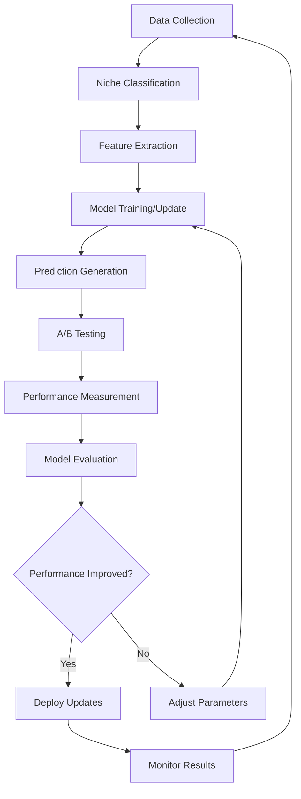

# AI Improvement Workflow - Master Implementation Plan

## 🚀 Executive Summary

This document outlines the comprehensive implementation of an AI-powered optimization system that continuously improves all workflows through machine learning, multi-agent deployment, and niche-specific optimization. The system creates a self-improving feedback loop that optimizes performance over time.

## 📋 Current State Analysis - TODOs and Gaps

### Critical Implementation Gaps Identified:

#### Data Collection Workflow
- **TODO**: Complete TikTok API integration (`TikTokClient.ts` lines 95, 108)
- **TODO**: Complete Instagram API integration (`InstagramClient.ts` lines 202, 206)
- **TODO**: Implement YouTube video upload functionality (`YouTubeClient.ts` line 208)
- **Gap**: Real-time data streaming pipeline
- **Gap**: Data quality validation system
- **Gap**: Niche-specific data collection strategies

#### Service Layer Implementations
- **TODO**: Complete autoposting service (`autoposting.ts` - currently placeholder)
- **TODO**: Complete content generation service (`contentGeneration.ts` - currently placeholder)
- **TODO**: Complete competitor tactics service (`competitorTactics.ts` - currently placeholder)
- **TODO**: Complete video optimization service (`videoOptimization.ts` - currently placeholder)

#### AI Improvement Workflow
- **Gap**: Machine learning model training pipeline
- **Gap**: Niche-specific model variants
- **Gap**: Real-time model inference
- **Gap**: A/B testing automation
- **Gap**: Computer vision implementation (currently stub in `vision.ts`)

#### Auth and Security
- **TODO**: Complete auth code exchange for all platforms (`auth-token-manager.service.ts` line 358)
- **Gap**: Token refresh automation
- **Gap**: Rate limiting optimization

## 🧠 Machine Learning Architecture

### Core ML Models by Function

#### 1. Engagement Prediction Engine
```typescript
interface EngagementPredictionModel {
  modelType: 'XGBoost' | 'LightGBM';
  inputFeatures: [
    'caption_length', 'hashtag_count', 'posting_time', 'day_of_week',
    'sentiment_score', 'topic_relevance', 'visual_quality_score',
    'user_follower_count', 'historical_engagement', 'platform_algorithm_score'
  ];
  outputTarget: 'engagement_rate_prediction';
  nicheVariants: NicheModel[];
}
```

#### 2. Content Optimization Engine
```typescript
interface ContentOptimizationModel {
  modelType: 'GPT-4o-mini';
  specialization: 'content_enhancement';
  capabilities: [
    'caption_optimization', 'hashtag_recommendation',
    'tone_adjustment', 'call_to_action_generation',
    'emoji_placement', 'length_optimization'
  ];
  nicheSpecialization: boolean;
}
```

#### 3. Viral Prediction Engine
```typescript
interface ViralPredictionModel {
  modelType: 'LSTM_Transformer_Hybrid';
  inputFeatures: [
    'early_engagement_velocity', 'share_rate', 'comment_sentiment',
    'trending_topic_alignment', 'creator_authority_score',
    'platform_algorithm_signals', 'temporal_patterns'
  ];
  outputTarget: 'viral_probability_score';
  timeHorizons: ['1hour', '6hours', '24hours', '7days'];
}
```

#### 4. Computer Vision Analysis Engine
```typescript
interface VisionAnalysisModel {
  modelType: 'YOLOv8_ResNet_Hybrid';
  capabilities: [
    'thumbnail_quality_scoring', 'face_detection', 'object_recognition',
    'composition_analysis', 'color_palette_optimization',
    'text_overlay_optimization', 'visual_engagement_prediction'
  ];
  platforms: ['tiktok', 'instagram', 'youtube', 'facebook'];
}
```

### Niche-Specific Model Architecture

```typescript
enum ContentNiche {
  FITNESS = 'fitness',
  BUSINESS = 'business',
  ENTERTAINMENT = 'entertainment',
  EDUCATION = 'education',
  FOOD = 'food',
  TRAVEL = 'travel',
  TECH = 'tech',
  LIFESTYLE = 'lifestyle',
  HEALTH = 'health',
  FINANCE = 'finance'
}

interface NicheModel {
  niche: ContentNiche;
  baseModel: string;
  finetuningData: {
    minSamples: 10000;
    platforms: Platform[];
    performanceMetrics: string[];
  };
  specializationWeights: {
    contentStyle: number;
    audiencePreferences: number;
    platformAlgorithms: number;
    competitorAnalysis: number;
  };
}
```

## 📊 Training Data Requirements

### Data Collection Pipeline

#### Minimum Data Requirements per Niche
```typescript
interface NicheDataRequirements {
  niche: ContentNiche;
  minimumSamples: {
    posts: 10000;
    engagementEvents: 100000;
    userInteractions: 50000;
    competitorAnalysis: 1000;
  };
  platformCoverage: {
    tiktok: 40%;     // 4,000 posts
    instagram: 30%;  // 3,000 posts
    youtube: 20%;    // 2,000 posts
    facebook: 10%;   // 1,000 posts
  };
  timespan: '12_months';
  qualityMetrics: {
    completenessScore: 95%;
    accuracyScore: 98%;
    freshnessScore: 90%; // Data recency
  };
}
```

#### Data Collection Strategies by Platform

##### TikTok Data Collection
```typescript
interface TikTokDataStrategy {
  endpoints: [
    '/research/video/query/',
    '/research/user/info/',
    '/research/hashtag/videos/',
    '/research/trending/'
  ];
  rateLimits: {
    requestsPerDay: 10000;
    requestsPerSecond: 100;
  };
  focusAreas: [
    'trending_hashtags',
    'viral_content_patterns',
    'engagement_velocity',
    'audio_trends',
    'visual_elements'
  ];
}
```

##### Instagram Data Collection
```typescript
interface InstagramDataStrategy {
  endpoints: [
    '/media',
    '/insights',
    '/hashtag/recent_media',
    '/business_discovery'
  ];
  focusAreas: [
    'story_performance',
    'reel_optimization',
    'carousel_engagement',
    'shopping_integration',
    'influencer_patterns'
  ];
}
```

### Data Processing Pipeline

#### Real-time Data Ingestion
```python
# Python ML Pipeline Component
class RealTimeDataProcessor:
    def __init__(self, niche: str):
        self.niche = niche
        self.models = self.load_niche_models(niche)
        
    def process_content_stream(self, content_batch):
        """Process incoming content data in real-time"""
        processed_data = []
        for content in content_batch:
            features = self.extract_features(content)
            niche_score = self.classify_niche_relevance(features)
            if niche_score > 0.8:  # Only process relevant content
                processed_data.append({
                    'content': content,
                    'features': features,
                    'niche_score': niche_score,
                    'timestamp': datetime.now()
                })
        return processed_data
```

## 🔄 Continuous Improvement Feedback Loop

### System Architecture Flow



### Feedback Loop Implementation

```typescript
class ContinuousImprovementLoop {
  private models: Map<ContentNiche, MLModel>;
  private agents: Map<string, Agent>;
  
  async runImprovementCycle(): Promise<void> {
    // 1. Collect new performance data
    const performanceData = await this.collectPerformanceData();
    
    // 2. Update models with new data
    for (const [niche, data] of this.groupByNiche(performanceData)) {
      await this.updateNicheModel(niche, data);
    }
    
    // 3. Generate new optimization suggestions
    const suggestions = await this.generateOptimizations();
    
    // 4. Create A/B tests for top suggestions
    const experiments = await this.createABTests(suggestions);
    
    // 5. Monitor experiment results
    const results = await this.monitorExperiments(experiments);
    
    // 6. Update system based on results
    await this.implementSuccessfulOptimizations(results);
  }
}
```

## 🎯 Implementation Roadmap

### Phase 1: Foundation (Weeks 1-4)
#### Tasks:
1. **Complete Service Layer Implementations**
   - Implement autoposting service with real API calls
   - Complete content generation service with GPT-4o integration
   - Finish competitor tactics service with comprehensive analysis
   - Build video optimization service with computer vision

2. **Establish Data Pipeline**
   - Complete TikTok and Instagram API integrations
   - Build real-time data streaming infrastructure
   - Implement data quality validation systems
   - Create niche classification system

3. **Deploy Core ML Models**
   - Train engagement prediction models (XGBoost/LightGBM)
   - Deploy content optimization models (GPT-4o-mini)
   - Implement basic A/B testing framework
   - Set up model training pipeline

#### Agent Deployment (Phase 1):
- Master Orchestrator Agent
- Data Collection Optimization Agent
- Basic Content Optimization Agent

### Phase 2: Specialization (Weeks 5-8)
#### Tasks:
1. **Niche-Specific Model Training**
   - Collect minimum 10,000 samples per niche
   - Fine-tune models for each content niche
   - Implement niche classification accuracy >95%
   - Deploy specialized recommendation engines

2. **Advanced A/B Testing**
   - Automated experiment generation
   - Statistical significance automation
   - Cross-platform experiment coordination
   - Results interpretation and implementation

3. **Computer Vision Integration**
   - Thumbnail optimization models
   - Visual content quality scoring
   - Composition analysis
   - Color palette optimization

#### Agent Deployment (Phase 2):
- Engagement Prediction Agent
- A/B Testing Automation Agent
- Niche Specialization Agents (per niche)
- UI Master Agent

### Phase 3: Optimization (Weeks 9-12)
#### Tasks:
1. **Full Multi-Agent Deployment**
   - Deploy all specialized agents
   - Implement agent coordination protocols
   - Set up resource allocation systems
   - Monitor agent performance and conflicts

2. **Advanced UI Development**
   - Deploy all UI sub-agents
   - Create responsive interfaces
   - Implement real-time monitoring
   - Build comprehensive dashboards

3. **System Integration and Testing**
   - End-to-end system testing
   - Performance optimization
   - Security validation
   - User acceptance testing

#### Agent Deployment (Phase 3):
- All UI Sub-Agents
- Real-time Monitoring Systems
- Cross-workflow Integration Agents
- Performance Optimization Agents

### Phase 4: Scale and Optimize (Weeks 13-16)
#### Tasks:
1. **Performance Scaling**
   - Load testing and optimization
   - Database performance tuning
   - API rate limit optimization
   - Cache strategy implementation

2. **Advanced Analytics**
   - Predictive analytics dashboard
   - ROI tracking and reporting
   - Competitive intelligence automation
   - Market trend prediction

3. **Continuous Learning**
   - Automated model retraining
   - Performance drift detection
   - Concept drift adaptation
   - Feedback loop optimization

## 📈 Success Metrics and KPIs

### Primary KPIs
- **Engagement Rate Improvement**: Target 25% increase across all niches
- **Content Quality Score**: Target >8.5/10 average
- **Viral Content Production**: Target 15% of content achieving viral status
- **User Satisfaction**: Target >90% user satisfaction score
- **System Efficiency**: Target 30% reduction in manual interventions

### Technical Metrics
- **Model Accuracy**: >85% prediction accuracy across all models
- **Data Quality**: >95% completeness and accuracy
- **System Uptime**: >99.9% availability
- **Response Time**: <200ms average API response time
- **Agent Coordination**: <1% conflict rate between agents

## 🔐 Security and Compliance

### Data Protection
- End-to-end encryption for all data transmission
- PII anonymization in training datasets
- GDPR and CCPA compliance
- Regular security audits and penetration testing

### Model Security
- Model versioning and rollback capabilities
- Adversarial attack detection
- Output sanitization and validation
- Bias detection and mitigation

## 🚀 Getting Started - Master Orchestrator Implementation

Now that the comprehensive plan is established, the implementation begins with the Master Orchestrator Agent and core infrastructure setup. Each agent will be deployed according to the iteration assignments and prompt specifications outlined above.

The system is designed to be self-improving, with each component learning from data and optimizing performance over time while maintaining niche-specific expertise and avoiding agent conflicts through careful coordination and resource allocation.
