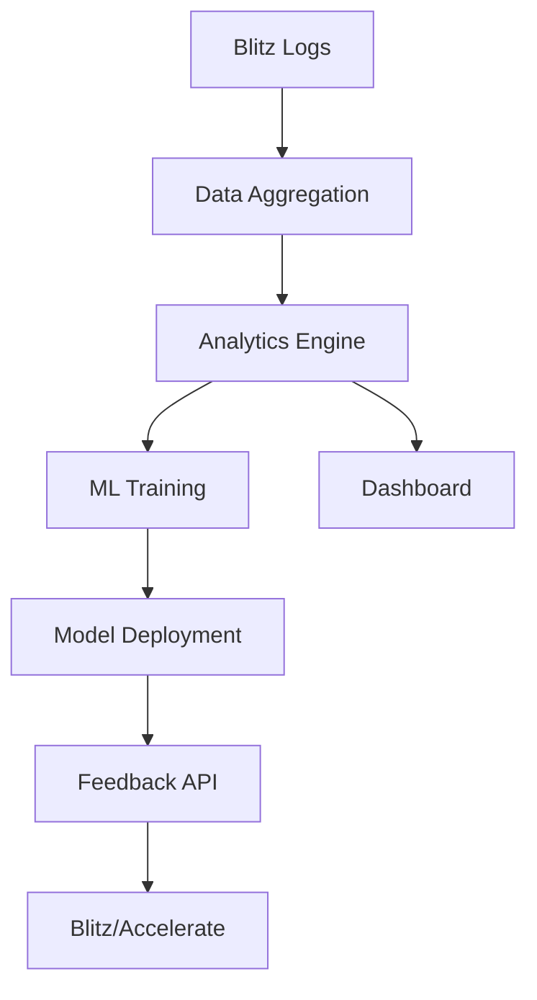

### **4. Cycle Module: Analytics & Learning Implementation**  
**(Closed-Loop Optimization System)**  

---

#### **Objective**  
Analyze post-performance data to refine scheduling logic, hook generation, and trend prediction through automated machine learning. Modular components ensure independent scalability.

---

### **1. Data Aggregation Module**  
**Inputs**: Post-launch metrics (views, engagement decay, shares), audit logs.  
**Outputs**: Cleaned, timestamped datasets in Snowflake.  

#### **Components**  
- **Data Pipeline**:  
  - **Tool**: Apache Airflow (DAGs).  
  - **Steps**:  
    1. Extract raw data from Blitz logs, platform APIs.  
    2. Clean (handle missing values, normalize timestamps).  
    3. Load into Snowflake `analytics` table.  
- **Key Decision**:  
  - **Columnar Storage**: Optimize for fast aggregations.  

```python
# Example Airflow DAG
with DAG("cycle_data_pipeline", schedule_interval="@daily") as dag:
    extract = PythonOperator(task_id="extract_blitz_logs", ...)
    transform = PythonOperator(task_id="clean_data", ...)
    load = SnowflakeOperator(task_id="load_to_dw", ...)
    extract >> transform >> load
```

---

### **2. Analytics Engine**  
**Inputs**: Aggregated data.  
**Outputs**: Insights (best posting hours, hook success rates).  

#### **Components**  
- **Batch Processing**:  
  - **Tool**: dbt (SQL transformations).  
  - **Key Models**:  
    - `avg_engagement_by_hour.sql`: Peak engagement windows.  
    - `hook_success_correlation.sql`: Top-performing hook templates.  
- **Real-Time Stream**:  
  - **Tool**: Apache Flink (for live trend velocity).  

```sql
-- dbt model: avg_engagement_by_hour.sql
SELECT 
  HOUR(scheduled_time) AS hour,
  AVG(engagement_rate) AS avg_engagement
FROM analytics.post_metrics
GROUP BY 1
```

---

### **3. ML Training Pipeline**  
**Inputs**: Insights + historical data.  
**Outputs**: Retrained models (scheduler, hook generator).  

#### **Components**  
- **Feature Store**:  
  - **Tool**: Feast (feature registry).  
  - **Features**: `post_hour`, `hook_type`, `trend_velocity`.  
- **Model Training**:  
  - **Framework**: PyTorch Lightning.  
  - **Model**: LSTM for time-series prediction.  
- **Trigger**: Daily cron job or event-based (e.g., 1k new posts).  

```python
# Example training script
trainer = pl.Trainer()
model = EngagementPredictor()
trainer.fit(model, DataLoader(dataset))
```

---

### **4. Model Deployment**  
**Inputs**: Trained model binaries.  
**Outputs**: Updated models in production.  

#### **Components**  
- **A/B Testing**:  
  - **Tool**: MLflow (model registry).  
  - **Strategy**: Shadow mode (compare new vs. old model outputs).  
- **CI/CD**:  
  - **Tool**: GitHub Actions (automate deployment on validation pass).  

```yaml
# GitHub Actions workflow
- name: Deploy Model
  if: github.event.model_accuracy > 0.85
  run: |
    aws s3 cp model.pth s3://prod-models/
```

---

### **5. Feedback API**  
**Inputs**: Model predictions, analytics insights.  
**Outputs**: Optimized parameters for Blitz/Accelerate.  

#### **Components**  
- **Endpoints**:  
  - `GET /optimal-hours`: Returns AI-refined posting schedule.  
  - `POST /update-hooks`: Pushes new hook templates to Redis.  
- **Key Decision**:  
  - **GraphQL**: Fetch multiple insights in one query.  

```graphql
query {
  optimalHours(platform: "tiktok") {
    hour
    expectedEngagement
  }
}
```

---

### **6. Reporting Dashboard**  
**Inputs**: Insights, model performance metrics.  
**Outputs**: User-facing analytics UI.  

#### **Components**  
- **Frontend**: React + Plotly.js.  
- **Data API**: GraphQL endpoint.  
- **Key Widgets**:  
  - Engagement heatmaps.  
  - Hook effectiveness scores.  

```javascript
// React component: EngagementHeatmap.js
<Plot
  data={[{
    z: engagementData,
    type: 'heatmap',
    colorscale: 'Viridis'
  }]}
/>
```

---

### **Critical Technical Decisions**  
1. **Modular Data Flow**:  
   - Airflow → dbt → Feast → PyTorch decouples stages.  
2. **Shadow Deployment**:  
   - Safely test new models without affecting users.  
3. **GraphQL API**:  
   - Reduces dashboard latency by batching requests.  

---

### **Deployment Architecture**  


---

### **Testing Strategy**  
- **Data Pipeline**: Validate schema with Great Expectations.  
- **ML Models**: Track accuracy drift with Evidently AI.  
- **API**: Postman + Jest for endpoint reliability.  

---