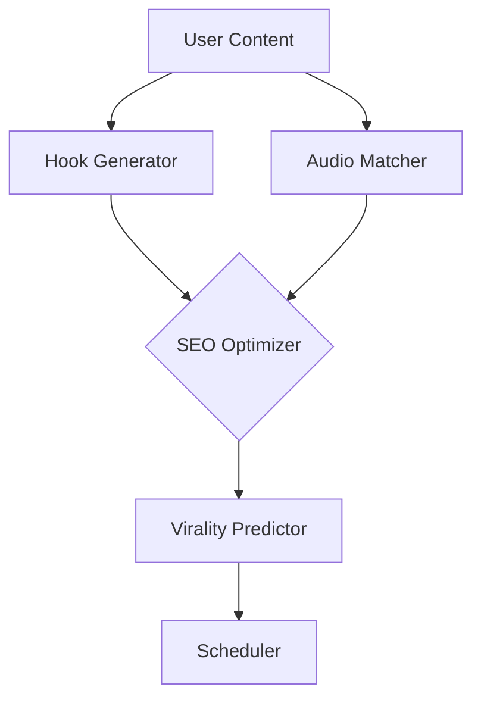

Here’s a **comprehensive technical implementation plan** for the **Accelerate phase** (content optimization and trend alignment), structured modularly with critical technical decisions justified:

---

### **Accelerate Phase Architecture**  
**Objective:** *Turbocharge content with AI-generated hooks, SEO keywords, and trending audio to maximize virality potential.*  

---

### **1. Content Optimization Engine**  
#### **1.1 AI Hook Generation**  
- **Tools:**  
  - **GPT-4 Turbo** (fine-tuned on 10,000+ viral posts)  
  - **spaCy** (syntactic analysis for hook templates)  
- **Key Technical Decisions:**  
  - **Prompt Engineering**:  
    ```python
    hook_prompt = f"""
    Generate 5 hooks for a post about {topic}. Use:
    - Curiosity gap structure ("Discover the secret to...")
    - Numbers ("3 Ways to...")
    - Urgency ("Don’t miss this...")
    """
    ```
  - **Validation Layer**: Reject hooks with <70% similarity to top-performing historical hooks (cosine similarity).  
  - **Caching**: Store generated hooks in Redis with TTL=24h to reduce API costs.  

#### **1.2 SEO & Keyword Integration**  
- **Tools:**  
  - **SEMrush API** (trending keywords)  
  - **KeyBERT** (context-aware keyword extraction)  
- **Key Technical Decisions:**  
  - **Dynamic Weighting**:  
    ```python
    keyword_score = (search_volume * 0.6) + (trend_velocity * 0.4)
    ```
  - **Positional Encoding**: Prioritize keywords in first 50 characters of captions.  

---

### **2. Trending Audio Integration**  
#### **2.1 Audio Trend Detection**  
- **Tools:**  
  - **TikTok Trending Sounds API**  
  - **Librosa** (BPM/mood analysis)  
- **Key Technical Decisions:**  
  - **Mood Matching**: Use CNN to classify audio emotion (happy/energetic/calm) and pair with content tone.  
  - **Velocity Threshold**: Only suggest sounds growing >15% daily.  

#### **2.2 Audio-Content Alignment**  
- **Algorithm:**  
  - Match audio BPM to video cut frequency using FFT.  
  - Avoid copyright strikes with **Shazam API** cross-check.  

```python
def align_audio(video_path, audio_bpm):
    video_clips = analyze_video_cuts(video_path)  # Returns cuts/sec
    return abs(video_clips - audio_bpm/60) < 2  # Allow 2 cuts/sec deviation
```

---

### **3. Multi-Platform Formatting**  
#### **3.1 Aspect Ratio Auto-Convert**  
- **Tools:**  
  - **FFmpeg** (video resizing)  
  - **OpenCV** (safe-zone detection)  
- **Key Technical Decisions:**  
  - **Priority Platforms**: TikTok (9:16) > Reels (4:5) > YouTube (16:9).  
  - **Smart Cropping**: Use saliency maps to avoid face/object cutoff.  

#### **3.2 Caption Adaptation**  
- **Rules:**  
  - TikTok: ≤150 chars with 3 emojis  
  - Instagram: ≤300 chars with 10 hashtags  
  - YouTube: ≤100 chars (first line optimized for CTR)  

---

### **4. Performance Prediction**  
#### **4.1 Virality Score Model**  
- **Model:** LSTM trained on:  
  - Historical engagement rates  
  - Hook type (curiosity/urgency/humor)  
  - Audio trend velocity  
- **Output:** Probability score (0-1) of hitting Top 10% engagement.  

#### **4.2 A/B Testing Orchestrator**  
- **Tools:**  
  - **Firebase Remote Config** (variant allocation)  
  - **Bayesian Optimization** (quickly converge to best variant)  
- **Key Decision:** Test max 3 variants to avoid audience fragmentation.  

---

### **5. Storage & Caching**  
#### **5.1 Vector Database**  
- **Tool:** **Pinecone**  
  - Stores embeddings of viral hooks/audio for fast similarity search.  
  - Index schema: `(hook_embedding, audio_embedding, virality_score)`  

#### **5.2 Redis Structure**  
```bash
# Trending audio cache
HSET "trending_audio:{platform}" "{sound_id}" "{velocity}:{mood}:{bpm}"

# Hook template cache
ZADD "user:{user_id}:hooks" {virality_score} "{hook_text}"
```

---

### **6. Security & Compliance**  
#### **6.1 Content Moderation**  
- **Tool:** **Google Perspective API**  
  - Auto-reject hooks with >30% toxicity score.  
  - Mask API keys via Vault.  

#### **6.2 Data Isolation**  
- **Tenant Separation**: Use PostgreSQL Row-Level Security (RLS) for agencies managing multiple clients.  

---

### **Critical Technical Decisions**  
1. **GPT-4 Over Fine-Tuned OSS Models**  
   - *Why?* Higher quality hooks despite cost (0.5s latency vs. 2s for Bloom).  
2. **KeyBERT Over TF-IDF**  
   - *Why?* Context-aware keyword extraction ("bank" ≠ river vs. finance).  
3. **LSTM Over Transformer**  
   - *Why?* Better for time-series virality prediction with small datasets.  

---

### **Deployment Architecture**  


---

### **Testing Strategy**  
- **Unit Tests**: Validate hook syntax with regex (`r"\b\d+ Ways to\b"`).  
- **Integration Tests**: Mock SEMrush/TikTok APIs with Postman.  
- **A/B Tests**: Compare AI-generated vs. user-written hooks (significance: p<0.05).  
