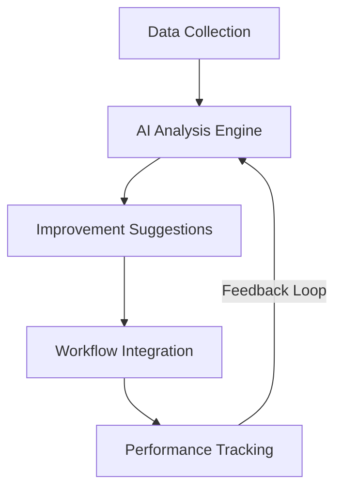

# AI Improvement Workflow

## Overview
The AI Improvement Workflow is designed to enhance all other workflows through machine learning and AI-powered optimizations. It analyzes historical data, identifies patterns, and provides intelligent suggestions to improve content performance across all platforms.

## Architecture



## Core Components

### 1. Content Optimization Module

#### 1.1 Tone Analysis & Optimization
- **Implementation**:
  - Use NLP to analyze successful content tones
  - Implement sentiment analysis for engagement correlation
  - Create tone adjustment suggestions
  - A/B test different tones

#### 1.2 Caption & Hashtag Enhancement
- **Implementation**:
  - Analyze high-performing captions
  - Generate optimized caption variations
  - Recommend trending and relevant hashtags
  - Suggest emoji usage patterns

### 2. Performance Prediction

#### 2.1 Engagement Forecasting
- **Implementation**:
  - Train time-series models on historical performance
  - Predict engagement metrics for new content
  - Identify optimal posting times
  - Forecast virality potential

#### 2.2 Audience Analysis
- **Implementation**:
  - Cluster audience segments
  - Predict content preferences
  - Suggest content variations for different segments
  - Track audience evolution over time

### 3. Visual Content Enhancement

#### 3.1 Thumbnail Optimization
- **Implementation**:
  - Analyze high-performing thumbnails
  - Generate A/B test variations
  - Suggest improvements based on visual patterns
  - Implement face/object detection for composition

#### 3.2 Video Content Analysis
- **Implementation**:
  - Analyze video engagement patterns
  - Identify drop-off points
  - Suggest content pacing adjustments
  - Recommend optimal video length by platform

## Implementation Plan

### Phase 1: Foundation (Weeks 1-4)
1. **Data Pipeline**
   - Set up data collection from all workflows
   - Implement data preprocessing pipelines
   - Create feature store for ML models

2. **Basic Models**
   - Implement baseline prediction models
   - Set up model evaluation framework
   - Create A/B testing infrastructure

### Phase 2: Core Features (Weeks 5-8)
1. **Content Optimization**
   - Deploy NLP models for text analysis
   - Implement suggestion generation
   - Create feedback collection system

2. **Performance Prediction**
   - Train and deploy time-series models
   - Implement real-time prediction API
   - Set up monitoring for model performance

### Phase 3: Advanced Features (Weeks 9-12)
1. **Visual Analysis**
   - Deploy computer vision models
   - Implement visual content scoring
   - Create A/B testing for visual elements

2. **Automated Optimization**
   - Implement automated content adjustments
   - Create self-improving feedback loops
   - Deploy reinforcement learning for continuous improvement

## Integration Points

### Data Collection Integration
```typescript
interface AIDataCollection {
  contentPerformance: ContentPerformance[];
  userInteractions: UserInteraction[];
  platformMetrics: PlatformMetric[];
  competitorAnalysis: CompetitorData[];
}
```

### API Endpoints
```typescript
// Get content optimization suggestions
POST /api/ai/optimize/content

// Get performance predictions
POST /api/ai/predict/performance

// Submit feedback on suggestions
POST /api/ai/feedback

// Get automated content variations
POST /api/ai/generate/variations
```

## Technical Stack

### Core Technologies
- **Machine Learning**: TensorFlow.js, PyTorch
- **NLP**: spaCy, Hugging Face Transformers
- **Computer Vision**: OpenCV, TensorFlow Object Detection
- **Data Processing**: Pandas, NumPy
- **API**: FastAPI, GraphQL
- **Storage**: PostgreSQL (structured), Redis (caching)
- **Deployment**: Docker, Kubernetes

## Monitoring & Evaluation

### Key Metrics
- Suggestion acceptance rate
- Performance improvement from suggestions
- Model accuracy and drift
- Processing latency
- User satisfaction scores

### Alerting
- Model performance degradation
- Data quality issues
- System health metrics
- Integration failures

## Future Enhancements

### Short-term
- Real-time content optimization
- Cross-platform performance prediction
- Automated A/B testing framework

### Long-term
- Generative AI for content creation
- Predictive audience growth modeling
- Automated campaign management
- Sentiment-based scheduling

## Getting Started

### Prerequisites
- Node.js 18+
- Python 3.9+
- Docker
- Redis
- PostgreSQL

### Installation
```bash
# Clone the repository
git clone https://github.com/yourorg/socialschedule.git

# Install dependencies
cd socialschedule
npm install
pip install -r requirements.txt

# Set up environment variables
cp .env.example .env

# Start services
docker-compose up -d

# Run migrations
npm run db:migrate

# Start the development server
npm run dev
```

## Contributing
1. Fork the repository
2. Create a feature branch
3. Commit your changes
4. Push to the branch
5. Create a Pull Request

## License
This project is licensed under the MIT License - see the [LICENSE](LICENSE) file for details.
